# Arduino_AHRS_System
This is a compact realtime embedded Inertial Measurement System (IMU) based Attitude and Heading Reference System (AHRS) using Recursive Least Squares (RLS) for magnetometer calibration, and EKF/UKF for sensor fusion for Arduino platform.

- It's not using Eigen (small source code - more simple to understand).
- It's not using C++ Standard Library/std (for embedded consideration).
- If you set `SYSTEM_IMPLEMENTATION` to `SYSTEM_IMPLEMENTATION_EMBEDDED_NO_PRINT` in `konfig.h`, the code is platform agnostic (not using any library beside these C header files: `stdlib.h`, `stdint.h`, and `math.h`).
- There's no malloc/new/free dynamic memory allocation (for real time application). But it use heavy stack local variables, so you need to run it through memory analyzer if you are really concerned about implement this in mission critical hard real time application.

This code is the application of Extended Kalman Filter and Unscented Kalman Filter library I've made.

- The EKF library and documentation can be found in [this repository](https://github.com/pronenewbits/Embedded_EKF_Library).
- The UKF library and documentation can be found in [this repository](https://github.com/pronenewbits/Embedded_UKF_Library).

Please read them to gain insight on how I implement the filters.

# The Background

This repository is made to explain the basic system of AHRS system based on an IMU sensor. For ease of use and simple implementation, I use low cost MPU-9250 sensor as the IMU sensor and Teensy 4.0 (an Arduino compatible platform) as the computing module. You can get the Teensy from [here](https://www.pjrc.com/store/teensy40.html), while you can get the MPU-9250 from, well, everywhere (just make sure the MPU-9250 module you get is 3.3V version).

Before we delve deeper, some results for motivational purposes:

1. EKF result using single precision floating math:

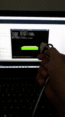

(See mp4 files for every result using EKF/UKF filter with single and double precision floating math).

2. UKF result using double precision floating math:

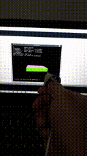

(See mp4 files for every result using EKF/UKF filter with single and double precision floating math).

3. Online hard-iron bias identification using RLS for magnetometer data compensation:

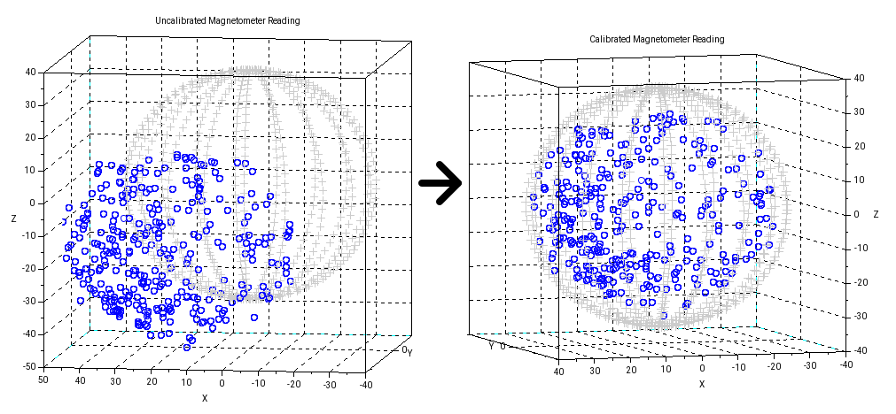

# The Theoritical Description

The AHRS system implemented here consists of 2 major subsystem:

### Subsystem 1: The Sensor Fusion Algorithm

Sensor fusion algorithm works by combining Gyroscope sensor (good for short measurement because of low noise, but not good for long measurement because of drifting), Accelerometer sensor (good for long measurement, but noisy and can only sense one direction, namely [earth's gravitational vector](http://weelookang.blogspot.com/2015/01/ejss-gravity-field-visualisation-model.html0)) and Magnetometer sensor (good for long measurement, but noisy and can only sense one direction, namely [earth's magnetic vector](https://en.wikipedia.org/wiki/Earth%27s_magnetic_field#Characteristics)).

To avoid [gimbal lock](https://en.wikipedia.org/wiki/Gimbal_lock), we use [quaternion](https://en.wikipedia.org/wiki/Quaternions_and_spatial_rotation) to represent where the system is heading (i.e. [the roll, pitch, and yaw of the sensor body](https://en.wikipedia.org/wiki/Flight_dynamics_(fixed-wing_aircraft))). The quaternion kinematics equations can be described as:

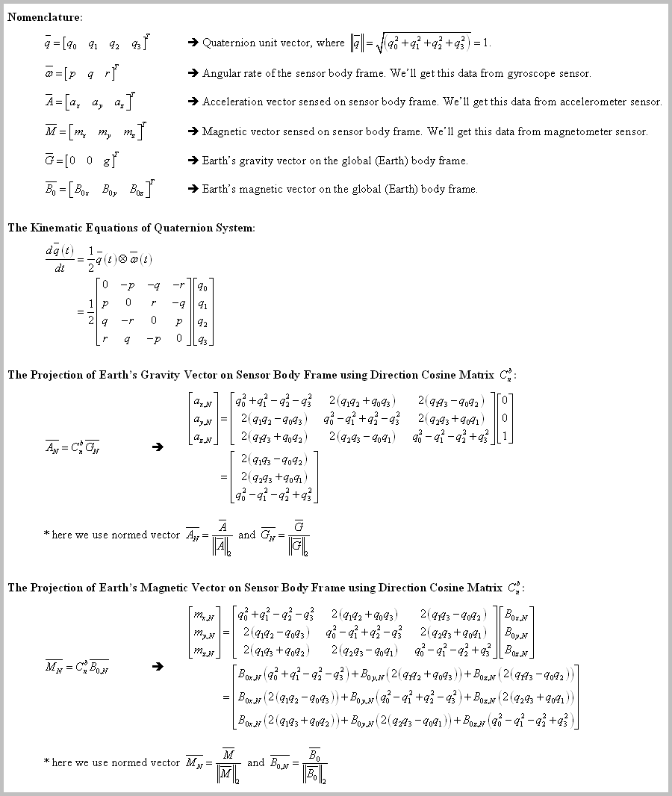

We then redescribe the kinematics equations into a (continuous) nonlinear state space equation:

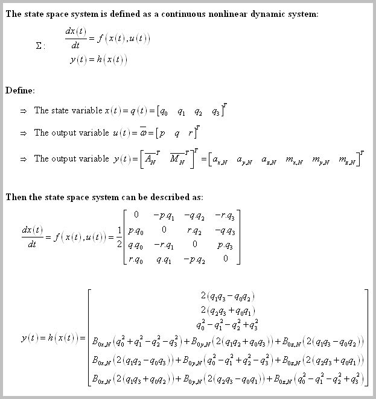

For sensor fusion algorithm, I use (discrete) Extended Kalman Filter and (discrete) Unscented Kalman Filter library I've made in [this repository](https://github.com/pronenewbits/Embedded_EKF_Library) (for EKF) and [this repository](https://github.com/pronenewbits/Embedded_UKF_Library) (for UKF). Because of that, we need to transform the equations above into the discrete form that can be used by EKF & UKF. Assuming ZOH-based sensor sampling, the discrete system (and the Jacobian for EKF) can be derived using Euler method as:

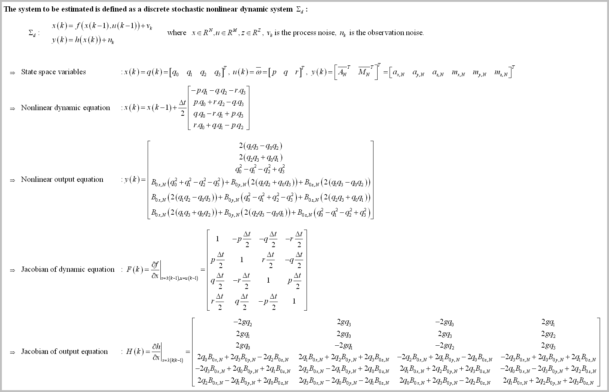

**Remark**: This is the simplest state space system for quaternion based AHRS using MEMS IMU sensor. Many publication use additional state to compensate gyroscope bias and accelerometer bias (some also set the magnetometer bias as another estimated state, not as parameters in the calibration phase), while others expand further by adding state for 3D speed or position (with additional GPS and pressure sensor, or even camera based machine vision) to make a complete guidance system. I hope by using this framework as a base, you can easily explore many different model.

&nbsp;

### Subsystem 2: The Magnetometer Calibration Algorithm

Each of the three sensors (accelerometer, gyroscope, magnetometer) have 12 parameters that need to be calibrated to make sure sensor data have no offset or deformity. They are:

- 3 parameters of sensor bias 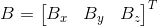.
- 9 parameters of sensor deformity matrix that represented by 3x3 matrix 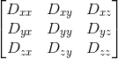.

In general, if we have measurement from one of the three sensors 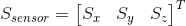, then the true sensor data 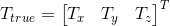 can be calculated by this equation:

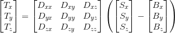

**Note** that this equation doesn't consider stochastic noise (i.e. this is still a deterministic calibration equation), the stochastic noise will be dealt with sensor fusion algorithm described above.

&nbsp;

In total, we have 12 parameters x 3 sensors = 36 parametes total for IMU sensor (actually we haven't consider cross sensor calibration, e.g. gyroscopic sensitivity from linear acceleration parameters, or the temperature-dependence parameters. [Analog Devices made excellent article about them](https://www.analog.com/en/technical-articles/gyro-mechanical-performance.html)). So the total calibration parameters is more than that.

Fortunately, for many cases the magnetometer bias (the so called hard-iron bias) is the most dominating one. So by compensating the hard-iron bias we can get a good enough sensor data (at least good enough for our purpose). The other sensor's bias and sensor's structural error (hopefully) is not significant enough and can be considered general noise and (hopefully) will be compensated by sensor fusion algorithm. The hard-iron bias identification equation can be derived as:

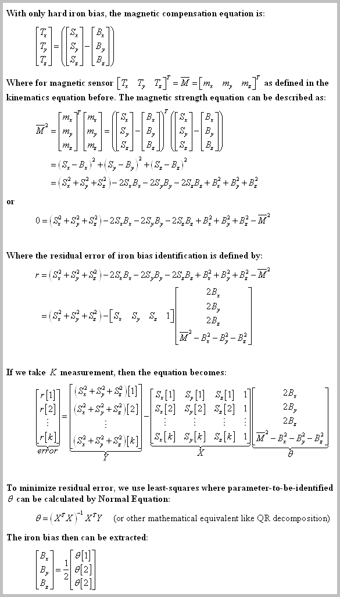

The equation above is an offline or batch identification (you take big enough sample, preferably more than 1000 samples, then using least-squares to identify the bias). The problem with batch identification is the needs for big memory, but we can use [Recursive Least Squares](https://en.wikipedia.org/wiki/Recursive_least_squares_filter) as the online version to calculate the bias (this way we don't need to store all samples data):

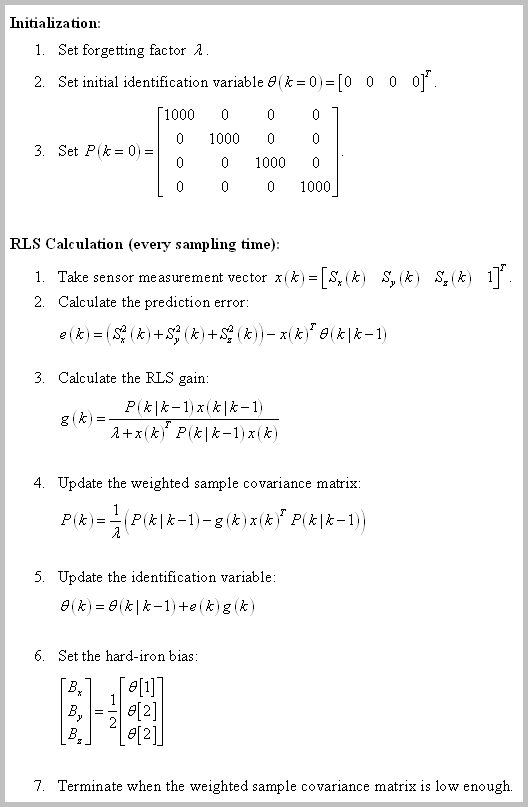

**Note**: The RLS algorithm above is general enough that you could also use it to indentify not only hard-iron bias, but also soft-iron bias (or the deformity matrix described above). For example, [this paper](https://www.ncbi.nlm.nih.gov/pmc/articles/PMC7014484/pdf/sensors-20-00535.pdf) explore further by using RLS/ML combination to calculate 12 magnetometer calibration parameters.

# The Implementation

### Electrical Implementation
The electrical connection can be seen here:

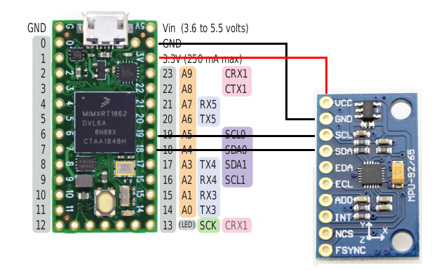

You only need to use 4 jumper cables to connect them: +3.3VCC, GND, I2C's SDA, and I2C's SCL (the MPU-9250 support SPI and I2C communication mode, but we use only I2C here). 

To communicate with the MPU-9250, I use I2C MPU-9250 library from [bolderflight project](https://github.com/bolderflight/MPU9250).

### Programming Implementation

This is the state machine for the whole system:

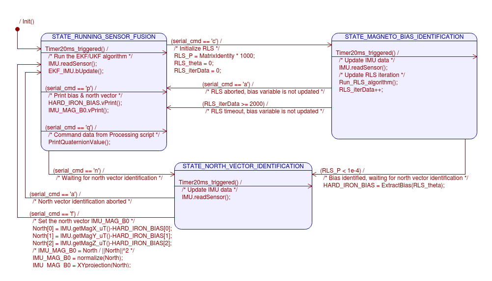

As you can see, there are 3 states in the state machine:

**1. STATE_RUNNING_SENSOR_FUSION**

This is the default state after booting, here every 20 ms (or whatever `SS_DT_MILIS` constant you set) the sensor fusion is running and calculate the quaternion of the sensor body frame. Send command `'c'` via Arduino's Serial Monitor (or any serial program communication you use) to get into `STATE_MAGNETO_BIAS_IDENTIFICATION`. Send command `'q'` to get the quaternion value (this is typically done automatically if you run the Processing script.

**2. STATE_MAGNETO_BIAS_IDENTIFICATION**

This state is where the RLS algorithm run every 20 ms (or whatever `SS_DT_MILIS` constant you set). Make an '8 maneuver' you usually do everytime you calibrate the magnetometer on your smartphone. If the algorithm convergent, the state machine move into `STATE_NORTH_VECTOR_IDENTIFICATION`; while if the algorithm is not convergent (usually your maneuver doesn't give enough coverage for magnetometer bias identification), the algorithm will be timeout after 2000 iteration (~40 seconds) and back into `STATE_RUNNING_SENSOR_FUSION` without update the bias.

**3. STATE_NORTH_VECTOR_IDENTIFICATION**

In this state, point the sensor into the 'north direction' of your choice and send `'f'` command (can be the North pole direction, or can be whatever local north you want to be). After this, that direction will be your navigation north.

# How to Use

Just place one of the implementation folder ("[ahrs_ekf_engl](ahrs_ekf_engl)" or "[ahrs_ukf_engl](ahrs_ukf_engl)") in your Arduino installation folder and run with it! Inside each folder you will find these files:
- `matrix.h/cpp` : The backbone of all my code in this account. This files contain the class for Matrix operation.
- `ekf.h/cpp` or `ukf.h/cpp` : The source files of the EKF/UKF Class.
- `konfig.h` : The configuration file.
- `*.ino` : The arduino main file.

For the data visualization, I use script modified from [FreeIMU project](http://www.varesano.net/files/FreeIMU-20121122_1126.zip) (You need [Processing to run these script](https://processing.org/)). Just place the "[FreeIMU_cube](FreeIMU_cube)" folder in your Processing installation folder and run the script. 
You need to run the script **after** you finished the calibration procedure described above in ***Programming Implementation*** section above (if not, the AHRS system will use the bias & north data from the identification I did which might be not valid anymore for your hardware/location).

For custom implementation (for example you want to change the state space or the identification equation), typically you only need to modify `konfig.h` and `*.ino` files. Where basically you need to:
1. Set the length of `X, U, Z` vectors and sampling time `dt` in `konfig.h`, depend on your model.
2. Implement the nonlinear update function `f(x)`, measurement function `h(x)`, jacobian update function `JF(x)` (no need for if you use UKF as the sensor fusion algorithm), jacobian measurement function `JH(x)` (no need for if you use UKF as the sensor fusion algorithm), initialization value `P(k=0)`, and `Qn & Rn` constants value in the `*.ino` file.
3. Change the `RLS_*` vector length and the RLS extraction equation if you want to change the variable you want to identify.

&nbsp;

*For Arduino configuration (`SYSTEM_IMPLEMENTATION` is set to `SYSTEM_IMPLEMENTATION_EMBEDDED_ARDUINO` in `konfig.h`):
The code is tested on compiler Arduino IDE 1.8.10 and hardware Teensy 4.0 Platform.

*For PC configuration (`SYSTEM_IMPLEMENTATION` is set to `SYSTEM_IMPLEMENTATION_PC` in `konfig.h`):
The code is tested on compiler Qt Creator 4.8.2 and typical PC Platform.

**Important note: For Teensy 4.0, I encounter RAM limitation where the `MATRIX_MAXIMUM_SIZE` can't be more than 28 (if you are using double precision) or 40 (if using single precision). If you already set more than that, your Teensy might be unable to be programmed (stack overflow make the bootloader program goes awry?). The solution is simply to change the `MATRIX_MAXIMUM_SIZE` to be less than that, compile & upload the code from the compiler. The IDE then will protest that it cannot find the Teensy board. DON'T PANIC. Click the program button on the Teensy board to force the bootloader to restart and download the firmware from the computer.**

# Closing Remark
I hope you can test & validate my result or inform me if there are some bugs you encounter along the way! (or if you notice some grammar error in the documentation).

I published the code under CC0 license, effectively placed the code on public domain. But it will be great if you can tell me if you use the code, for what/why. That means a lot to me and give me motivation to expand the work (⌒▽⌒)
